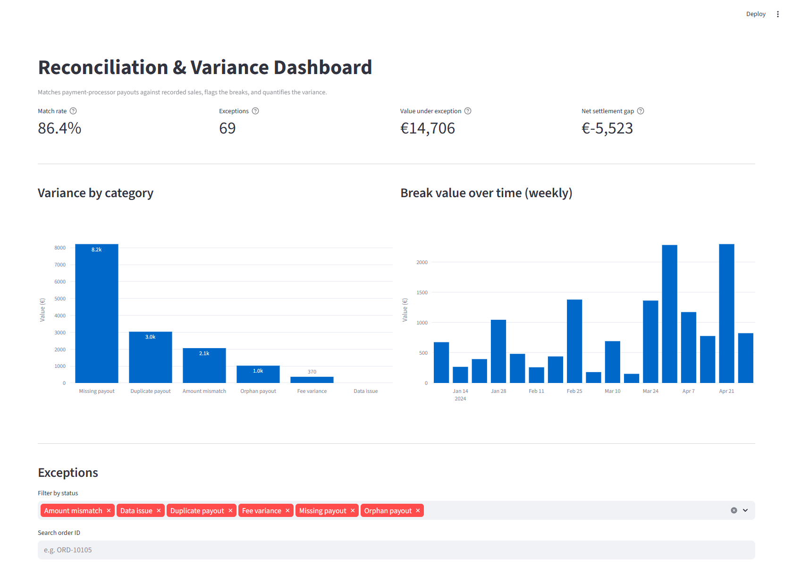

# Reconciliation & Variance Dashboard

Two systems record the same money - a payment processor's payouts, and the
sales a business recorded - and they're meant to agree. This tool checks
whether they actually do. It matches the two datasets, finds every break,
works out how much money each break is worth, and puts it all on a dashboard.



## Why I built this

Reconciliation is a big part of payment and fund operations work, and a lot of
the time it's still done by eye across two spreadsheets. That's slow, and it's
easy to miss something - and in finance the row you miss is usually the one
that mattered. I wanted to build it properly: something that does the matching
on its own and hands you a clean list of exceptions to work through.

## How it works

It's a pipeline, with one Python file per stage:

- `generate_data.py` - creates two synthetic CSVs, sales and payouts, with
  breaks deliberately built in (about 13% of the rows)
- `loader.py` - reads both files, fixes the types, and flags any malformed
  cells instead of dropping them
- `matcher.py` - matches payouts to sales and classifies every order
- `summary.py` - works out the headline numbers
- `app.py` - the Streamlit dashboard

### How the matching works

Every order is joined on its `order_id` and put into exactly one bucket:

- **matched** - the sale and the payout agree
- **missing payout** - a sale was recorded but the processor never paid out
- **orphan payout** - the processor paid out but there's no sale behind it
- **amount mismatch** - the payout is for a different amount than the sale
- **fee variance** - the amount is right but the fee is off the contracted rate
- **duplicate payout** - the same order got paid out twice
- **data issue** - a cell is malformed, so the row can't be compared at all

Two decisions in here I'd want to be able to explain:

**Amounts are compared with a small tolerance, not for exact equality.** Money
rounds at different points in different systems, so a payout can land a cent
off a sale without anything actually being wrong. If you test for exact
equality, those harmless rounding differences get flagged and the real breaks
are lost in the noise. The tolerance is 5 cents.

**Nothing gets dropped.** Every sale and every payout ends up somewhere in the
output. A payout with no matching sale doesn't quietly disappear - it becomes
an orphan payout exception. In a finance context the row you silently dropped
is exactly the one someone needed to see.

## Running it

```bash
pip install -r requirements.txt
python generate_data.py      # creates data/sales.csv and data/payouts.csv
streamlit run app.py         # opens the dashboard in your browser
```

Each stage also runs on its own if you just want to check it - for example
`python matcher.py` prints the breakdown of how every order was classified.

## What I learned

The part I didn't expect to spend time on was the tolerance. My first version
compared amounts for exact equality, and it flagged a pile of "breaks" that
were all just one-cent rounding differences - the genuine breaks were buried
underneath them. Choosing a sensible tolerance, and being able to say why,
turned out to be the difference between a report someone trusts and one they
ignore.

The other thing that stuck with me is that reconciliation isn't really about
the rows that match. It's about having a clear, honest answer for every row
that doesn't.

## A note on the data

All the data is synthetic - it's produced by `generate_data.py`. There is
nothing real or sensitive in this repo.
